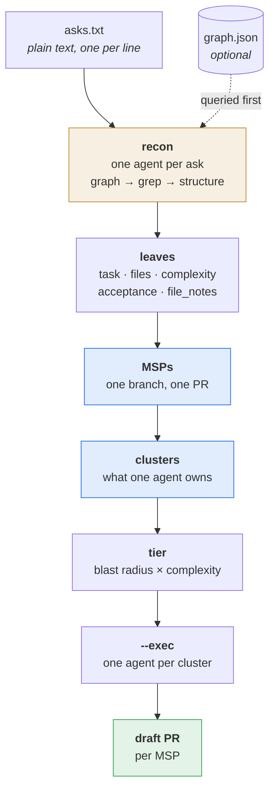

# fanout

Take a list of things you want built, work out what can run at once, and run it —
one agent per unit of work, one branch and one draft PR per shippable change.

Pure Python standard library: no dependencies, no network, no assumption about
which agent or runtime you use.

```bash
python3 fanout.py --asks asks.txt \
  --recon-exec 'your-agent-cli -p {prompt}' \
  --exec 'your-agent-cli -p {prompt}' \
  --base main --pr-exec 'gh pr create --draft --base {base} --head {branch} --title {title}'
```

`asks.txt` is plain text, one request per line. Everything else — which files
each one touches, what can run in parallel, who waits for whom, which model tier,
what each agent is told — fanout works out.

## The problem

Hand an agent five tasks and it will usually do them one at a time, because
deciding what is safe to run concurrently is genuinely hard: two tasks that edit
the same file must not run together, a task that consumes another's output must
wait for it, and two tasks that look independent can still collide (both adding a
sequentially-numbered migration to the same app, for instance).

Guessing is slow when you are too cautious and corrupting when you are not.
fanout computes the answer instead — and the part that cannot be computed
(reading "add a resolved filter" and working out which files that touches) it
delegates to an agent, then computes everything downstream deterministically.

## What it computes



Only the orange box is an LLM. Everything blue is deterministic and takes
milliseconds — same inputs, same plan, and `plan_id` hashes it.

Two units, and the difference matters:

- an **MSP** is one shippable change: one branch, one PR. Two leaves that edit
  the same file are forced into one MSP, because two open PRs must never touch
  the same file.
- a **cluster** is what one agent owns inside an MSP — leaves that must run in
  sequence because they collide or depend on each other. Independent leaves are
  clusters of one. Clusters run in parallel; a cluster with a dependency starts
  when its producer finishes, and nothing else waits with it.

A cluster never spans two MSPs, since it converges into one branch. So a
dependency between MSPs stays a dispatch **edge** — the consumer waits for the
producer's build, and nothing is merged into one agent behind your back.

There are no waves. A barrier would make a task wait on unrelated slow
neighbours; an edge makes it wait only on its actual predecessor.

If you already have items with their files worked out, skip recon and pass
`--items items.json` instead.

Give it the items and the files each one will edit:

```json
[
  {"name": "api",    "files": ["app/api/orders.py"], "cost": 3},
  {"name": "ui",     "files": ["src/pages/Orders.tsx"], "after": ["api"]},
  {"name": "typo-a", "files": ["src/copy/a.ts"]},
  {"name": "typo-b", "files": ["src/copy/b.ts"]}
]
```

It returns:

| field | what it answers |
|---|---|
| `msps` | which leaves ship together — one MSP is one branch and one PR |
| `clusters` | what one agent owns: leaves that must run in sequence |
| `cluster_after` | which clusters wait on which, carried per cluster, never per MSP |
| `cluster_briefs` | **what each agent must be told** — leaves, files, tasks, acceptance, and a ready-to-send prompt |
| `tier` | per item, `top` or `cheap`, from blast radius × complexity — route models off this |
| `underspecified` | leaves with no task — an agent whose whole brief is a name |
| `waves`, `ready_after` | legacy schedule fields; dispatch off clusters instead |
| `context_packs` | the files each task should read, so an agent is not left hunting |
| `coupling_review` | file-disjoint pairs that still carry a coupling signal |
| `verdict_groups` | those pairs bucketed, so one ruling covers many |
| `coalesce` | small tasks cheaper merged into one worker than spawned separately |
| `shared_context` | files several tasks would each read — read once, share the digest |
| `verify_mode` | whether a task's check needs a live session or can be offloaded |
| `plan_id` | a hash, so a run log can be tied to the plan it claims to have run |

**Nothing here is stack-specific.** fanout reasons about edited files and
declared dependencies, and never about what kind of thing is being built. A
library, a CLI, a service, a data pipeline and a web app all plan the same way:
the examples happen to be web-shaped, the tool is not.

**Merge safety keys on the edited FILE.** Not on symbols, not on transitive
imports. Graph-driven impact analysis was tried and rejected: transitive coupling
collapses a real codebase into one serial blob and destroys the parallelism you
came for. The graph stays advisory.

## Running the plan

A plan is advice a caller can quietly ignore — usually by running a parallel plan
serially, which looks identical afterwards and loses the entire win. `--exec`
removes the choice:

```bash
python3 fanout.py --items items.json \
  --exec 'your-agent-cli --prompt {prompt}' --concurrency 4
```

It dispatches **one agent per cluster**, up to the concurrency cap. A cluster
with no dependency starts immediately; one with a dependency starts the moment
its producer finishes. Priority goes to whatever unblocks the most work.

Each agent gets its cluster as a JSON brief — its leaves in order, and per leaf
the task, the files to edit, what to read for context, the acceptance line, and
per-file notes. That brief is in the plan as `cluster_briefs`, so if you would
rather spawn the agents yourself, you send exactly what `--exec` would.

**One branch per MSP is not optional** — it is what "one MSP, one PR" means. Each
MSP gets a git worktree on its own branch off `--base`; its clusters share that
tree, which is safe because they are file-disjoint by construction. When an MSP's
last cluster succeeds, its work is committed, pushed, and handed to `--pr-exec`.
A failed cluster blocks its MSP, so a half-built MSP never commits and never
opens a PR.

**Route the model off the tier, or the tiering saves nothing.** `--exec`
substitutes `{model}` from `--tier-models`, so the expensive model runs only
where the plan says it is warranted:

```bash
--exec 'claude --model {model} -p {prompt}' --tier-models top=opus,cheap=sonnet
--exec 'codex exec -m {model} {prompt}'     --tier-models top=gpt-5,cheap=gpt-5-mini
```

Agent-agnostic: the template is yours, so anything with a model flag works. If
`{model}` is used and a tier has no mapping, fanout refuses to start rather than
quietly running that cluster on your agent's default — which is the exact
failure tiering exists to prevent. `{tier}` substitutes the raw `top`/`cheap` if
you would rather branch in a wrapper script.

- `--no-push` commits without pushing; `--no-branches` runs everything in one
  tree, for a scratch or non-git directory.
- The command template is split into argv **before** substitution, so a prompt
  containing quotes, newlines or `;` can never be reinterpreted as shell syntax.
- A failure marks its dependents `blocked` and exits non-zero. A green exit is
  never a silent skip.
- `--dry-run` shows the dispatch order and the exact argv, spawning nothing.

Because dispatch is a subprocess concern, this works with an agent runtime that
has **no subagent primitive of its own** — the thing that otherwise forces a
capable planner back into single-file execution.

## What fanout does not do

It stops at open draft PRs. Reviewing the diff, deciding to merge, confirming the
deploy, and checking the change did what was asked are all somebody else's.

That line is deliberate. Everything fanout does is mechanical and re-runnable
from the same inputs; everything past it is judgement about whether the work is
right, which is not a scheduling problem. Merge especially: a scheduler that can
merge is a scheduler that can merge something wrong.

## The honest caveat

Merge safety rests on the files recon PREDICTED. Recon is an agent, so that is a
judgement, not a fact — and an under-predicted file list is the one error that
breaks a plan rather than slowing it.

So the guarantee is conditional and says so: **the plan is safe if recon was
right, and you are told when it was not.** After a run, `reconcile()` compares
predicted files against what each cluster actually changed. A surprise inside an
MSP is noise; one that lands in another MSP's files means those two were not
disjoint and the plan ran a real collision in parallel.

Read `--emit-items` before dispatching if the batch is expensive. It writes what
recon derived so you can correct it before anything is built.

## Optional inputs

- `--graph` — a [graphify](https://github.com/shaheershoaib) `graph.json`. Adds
  import-adjacency coupling signals and fills in `context_packs` neighbours.
  Without it everything else still computes.
- `--risk-markers` — paths that force the `top` tier. **You** supply these; the
  tool bakes in no paths and knows nothing about your domain. A plain marker
  matches a *word* of the path, case-insensitively, so `auth` matches
  `types/AuthResponse.ts` and `app/auth/route.ts` but not `(unauthenticated)`. A
  marker containing a separator (`api/auth`, `.sql`) is read as a path fragment.
- `--serial-verify-markers` — surfaces whose verification needs a real session.
- `--trajectories` — a JSONL history store, if you keep one. Strictly additive:
  history only ever raises caution, never relaxes it. Override the default path
  with `FANOUT_TRAJECTORY_STORE`.

## Testing

```bash
python3 -m unittest discover -s tests
```

42 tests, covering the scheduling algebra, the safety invariants, and the runner
(including that a prompt full of shell metacharacters stays one argument).

## Adapters

`adapters/claude-code/SKILL.md` wires it into Claude Code as a skill. The script
itself is the product; adapters are thin.

## License

[Apache 2.0](LICENSE) — free to use, modify, and share, including commercially.
Keep the [`NOTICE`](NOTICE) file with any redistribution (§4(d)), and don't market
a fork under the `fanout` name (§6). The patent grant in §3 means adopting this
doesn't expose you to a patent claim over it.

Required Notice: Copyright Shaheer Shoaib (https://github.com/shaheershoaib)
