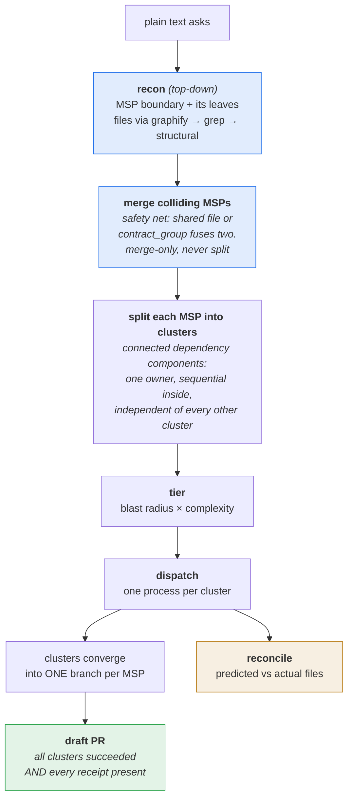

# fanout v2 — from a plain work-set to open PRs

## What changes

Today fanout is a scheduler: you hand it items **with their files already
predicted**, and it clusters and schedules them. Deriving those files lives in
the caller (`ship`'s step 0 recon), which is why fanout alone leaves an adopter
writing a harness.

v2 moves that derivation in. Fanout takes plain text asks and carries them to
open draft PRs. It still never merges, deploys, or verifies.

## Input

A plain list of asks. No tracker adapters, no auth, no network.

```
1 export button on /reports downloads an empty CSV
2 add a "resolved" filter to the incidents table
3 rename owner_id -> assignee_id across API + frontend
4 redesign the incident detail page
```

Whoever assembles that list — a human, or an LLM reading a Notion/Monday/Jira
board — is not fanout's concern. Enumeration stays with the caller; fanout owns
everything about the work once it is stated.

## Vocabulary (breaking rename)

The word **cluster moves down one level.**

| v2 term     | today       | meaning                                          |
|-------------|-------------|--------------------------------------------------|
| **MSP**     | `cluster`   | top unit. One MSP = one branch = one PR.         |
| **cluster** | *(none)*    | a connected dependency component in an MSP; one owner. |

So `cluster_items()` must be renamed `msp_items()`. Without that rename the code
returns the opposite of what this spec says.

## What is and is not an MSP

An MSP is a **minimum shippable product**: independently mergeable, CI-green,
deployable and revertable on its own. The test is one question — *if only this
merged, is the integration branch still coherent?*

A login form is one MSP. Its email field is not: merging it alone ships a login
with no password, which is the partial slice the definition exists to forbid.
Fields, layers and layers-of-one-feature are **clusters**, not MSPs.

Over-splitting into MSPs is the more damaging error, because each one opens its
own PR and invites a partial merge.

## Pipeline



**MSP boundaries are semantic, and recon draws them.** "What merges coherently
on its own" is readable from the ask itself, before any file has been looked at.
File overlap does not *define* an MSP — it can only ever **merge** two that
recon proposed separately and that turn out to collide. Merge-only, never
split.

1. **Ingest** — plain text asks.
2. **Recon** — top-down, in one pass: read each ask, decide the **MSP** it
   represents (the shippability test below), and enumerate that MSP's **leaves**.
   One ask may yield several MSPs, and an MSP has one or more leaves. Per leaf,
   derive `files`, `type`, and an `acceptance` line. Resolution order for files:
   - **graphify** — query the item's neighbourhood in `graph.json`.
   - **grep** — search the codebase for the named surface.
   - **structural** — for net-new work there is nothing to grep; reason from
     directory and module shape instead.

   Every path returns the same schema, tagged with its `source`.

   **Registration files are always predicted for net-new items.** A new feature
   almost always edits a central registry — a router, a DI container, an
   `index` barrel, a migrations directory — and no structural or grep pass
   infers that from the ask. Recon must add the project's registration and
   entrypoint files to any `feature` or `port` item by default. Two net-new
   items both silently editing `router.tsx` is a genuine cross-MSP collision
   that grouping would otherwise never see.
3. **Merge colliding MSPs** — the safety net, not the definition. If two MSPs
   recon proposed separately share an edited file or a `contract_group`, they
   fuse into one, because two open PRs must never edit the same file. This step
   only ever reduces the MSP count.
4. **Split each MSP into clusters** — a cluster is a **weakly-connected
   component of the dependency graph** within the MSP: one owner, sequential
   inside, and independent of every other cluster by construction, **subject to
   the contract rule below**. An MSP with no internal disjointness is a single
   cluster; an item with no dependencies is a cluster of one.

   **All-independent leaves is the best case** — every leaf its own cluster,
   every cluster parallel. So recon should prefer a split whose leaves do not
   depend on each other. It must never buy that by *pretending*: two coupled
   leaves declared independent is the contract-divergence failure with extra
   steps. A dependency recon can see belongs in the graph, where it costs one
   sequential step inside a cluster instead of a wrong build.
5. **Tier** — per cluster, from blast radius *and* complexity (see below).
6. **Dispatch** — one process per cluster. Every cluster without an `after`
   edge starts immediately, whatever MSP it belongs to. A cluster with an edge
   starts once its producer's build has completed. All of an MSP's clusters
   converge into that MSP's single branch.
7. **PR** — when an MSP completes, open a draft PR for its branch.
8. **Reconcile** — compare each cluster's returned `files_changed` against what
   recon predicted.

## The contract rule

Two halves of one interface — an endpoint and the UI that calls it — are
file-disjoint, so file-grouping alone would happily run them in parallel. Built
independently, they invent two different request shapes. `contract_group` marks
them.

The rule has two branches:

- **Contract not pinned → serialize.** The group is one cluster, one owner. This
  is today's behaviour and stays the default.
- **Contract pinned → parallel.** The interface becomes the **head of the
  chain**; the halves declare `after` it and then run concurrently against a
  fixed shape.

Pinning is what real teams do — agree the interface, then build both sides at
once. It is the only way `contract_group` members may be split.

## Cross-MSP dependencies

**One run handles the whole batch.** A dependency between MSPs is an *edge*, not
a barrier: B starts the moment A specifically is done, and no other MSP waits
with it.

What B needs from A decides the shape:

**B needs A's interface only.** Nothing is ordered. Pin the contract and build
both halves in parallel inside one MSP — the contract rule above.

**B needs A's code to exist.** The edge belongs on the **cluster that actually
needs it**, never on the whole MSP. If one of B's five leaves depends on A, that
leaf's cluster carries `after: [A]` and B's other four clusters start at t=0.
An MSP-level `after` is a derived fact — the union of its clusters' edges — and
never a dispatch gate. Gating all of B on A is a barrier at MSP scope, which is
the same error waves made one level up.

"Done" means **A's build completed**, not A merged — A's branch already holds
the code, so no merge is required mid-run. B's PR is still gated on A, since it
opens only once every B cluster has returned; B's *work* is not.

The branch mechanics are the one part that is not free. B's independent clusters
run on B's branch off the integration ref, while the dependent cluster needs A's
code, so B's branch must rebase onto A's branch before that cluster runs — and
rebasing under running agents invites corruption. **Run the dependent cluster
last:** wait for A's build *and* B's independent clusters, rebase, then dispatch
it. B's PR then stacks on A's.

- The stacking risk is real and worth stating: if A's PR changes in review, B
  rebases again. That is the cost of pipelining instead of waiting for a human.
- **Fusing stays available** when the two are small enough that one PR is the
  better unit — the dependency then becomes an edge inside a cluster and one
  agent walks it. Prefer fusing only when the fused diff is still reviewable
  (roughly 800 lines, no high-risk boundary crossed mid-way); fusing every
  dependent pair collapses a batch into one unreviewable PR, which fails the MSP
  definition from the other direction.

So the batch completes in one run, and the only thing that ever waits is an MSP
whose producer is genuinely still building.

## Tiering: add complexity as a second axis

Today `tier_for()` is one line — if any edited path matches a caller-supplied
risk marker the item is `top`, otherwise `cheap` — with
`history_tier_bump()` raising an item whose surface has a bad track record
(reverts, speculative ships, caused regressions, two or more prior traps).
History only ever raises caution, never lowers it.

That is **blast radius only**. A one-word copy change under `api/auth/` is
`top`; a genuinely hard refactor in an unmarked directory is `cheap`. Routing
models off that axis alone sends the capable model to trivial work and the cheap
model to hard work.

v2 adds the axis that was missing, because recon is an LLM and can judge it:

| | low blast radius | high blast radius |
|---|---|---|
| **simple** | cheap | top |
| **complex** | top | top |

Cheap only when the work is *both* mechanical and low-blast-radius. Everything
else goes top — the asymmetry is deliberate, since a wrong cheap-tier call costs
a rebuild and a wrong top-tier call costs tokens.

Fanout still emits `top` / `cheap`, never a model name. Which model each tier
maps to is the caller's, and model names change faster than this tool should.

## There are no waves

`waves` is a barrier schedule: everything in wave N runs, then everything waits,
then wave N+1 starts. fanout's own docstring already calls it the lesser shape —
`ready_after` exists "so a consumer can PIPELINE (start each item when ITS deps
land) instead of marching whole-wave barriers - wall-clock tracks the critical
path, not the sum of per-wave slowest items."

v2 keeps **edges** and drops **barriers**. The distinction is the whole point:
a barrier makes an item wait on unrelated slow neighbours; an edge makes it wait
only on its actual predecessor.

Inside an MSP there are no edges left to wait on at all. Because a cluster is a
**connected component** of the dependency graph, every intra-MSP dependency lies
*inside* some cluster, so all of an MSP's clusters start at once and the MSP is
done when the last returns.

Between MSPs, a real dependency stays an edge — and it is carried by the single
cluster that needs it, not by the MSP. Every other cluster in that MSP starts
immediately (see "Cross-MSP dependencies").

**The cost, stated plainly.** A diamond — `A→B`, `A→C`, `B+C→D` — falls entirely
into one component, so one agent walks it sequentially and the `B`/`C`
parallelism is lost. That is the price of an execution model with no waiting
logic, and it is worth paying: diamonds are rare in a work-set, and a scheduler
that can stall is a scheduler that can deadlock.

**Cross-MSP ordering is not a counterexample.** An MSP whose producer must merge
first is a *merge*-ordering concern, handled at the PR level as stacked MSPs —
and fanout does not merge.

### What happens to the two scheduling outputs

- **`waves` is removed.** It described a barrier that v2 has no way to express
  and no reason to want. Nothing emits it, nothing reads it.
- **`ready_after` survives, at two granularities.** Inside a cluster it is the
  sequence handed to the owning agent, so it knows which leaf to build first.
  Across MSPs it is the dispatch edge, carried per CLUSTER — the cluster that
  needs A waits, its siblings do not. Within an MSP it is always empty, because
  those edges live inside clusters.

So ordering exists exactly where a real dependency exists, and nowhere else.

## Item schema

```json
{
  "name": "login-form-ui",
  "text": "cool looking login form with email + password",
  "type": "fix | feature | port | design | sweep | contract",
  "files": ["web/src/pages/Login.tsx", "web/src/components/LoginForm.tsx"],
  "source": "graph | grep | structural",
  "acceptance": "submitting valid credentials lands on /dashboard",
  "after": ["auth-contract"],
  "contract_group": "login-api"
}
```

`source` is not for the subagent, which ignores it. It is for grouping and
reconcile: a `structural` prediction is far weaker than a `graph` one, and if
the schema hides that, merge safety silently rests on the weakest item in the
batch. Low-confidence items may default to serialize; a prediction miss on a
`structural` item reads as expected rather than as a grouping bug.

`acceptance` exists because the verification consumer pins its acceptance line
*before* the build, and fanout now owns the build. It travels into the PR body
so a cold session — days later, after review — still has a test to re-run.

## Floor (when not to plan)

Recon plus dispatch costs more than serial execution saves on small work. If the
plan comes out as one MSP with one cluster, fanout says so and recommends
building it directly rather than ceremonially planning a one-agent job.

A scheduler that always finds parallelism is a scheduler that is wrong
sometimes. "Do not fan out" is a valid and useful output.

## Completion and PR

Bookkeeping, not judgment. Each cluster carries its MSP id; `state.json` already
records completions as they land.

An MSP opens its draft PR when **every** member cluster has:

- `status: succeeded`, and
- a non-empty `receipt` in its return contract.

Exit 0 means the agent finished, not that the work is right. Without the receipt
condition, fanout opens PRs on unverified work — the exact failure the receipt
exists to catch.

A failed cluster marks its dependents `blocked`, so its MSP never completes and
never opens a PR. Partial work stays on the branch, the run-dir names the
cluster that died, and `--resume` picks it up. No half-shipped MSP.

Review happens **on** the draft PR, not before it. Opening a draft is cheap and
reversible, and it keeps judgment outside fanout.

## Reconcile

The plan's merge-safety claim rests on recon's prediction. Reconcile checks it
after the fact:

- predicted vs actual `files_changed`, per cluster;
- a miss *inside* the MSP is noise;
- a miss that **crosses an MSP boundary** means two MSPs were not disjoint and
  the plan parallelized a real collision. Report it loudly, keyed to `plan_id`.

This is the honest answer to losing determinism. Today's pitch is
"deterministic, milliseconds, JSON in / JSON out"; v2's inputs are an LLM's
guess. The guarantee changes from *the plan is safe* to **the plan is safe if
recon was right, and you will be told when it was not.** The README must say so.

## New flags

| flag | does |
|---|---|
| `--recon-exec '<cmd>'` | derive items from plain text asks |
| `--branch-per-msp`     | one branch per MSP, clusters converge into it |
| `--pr-exec '<cmd>'`    | e.g. `gh pr create --draft --base {base} --head {branch}` |
| `--base <ref>`         | integration ref for branches and PRs |

Every one is a shell-out, same pattern as `--exec`. Auth lives in the spawned
tool (`gh`, the agent CLI), never in fanout: stdlib and offline stay true.

## Boundary

Fanout does: recon, MSPs, clusters, scheduling, tiering, dispatch, branches,
draft PRs, resume, reconcile.

Fanout never: merges, deploys, verifies, closes.

Merge stays out for a reason that is not portability — it is a judgment (review
passed, CI green, blast radius acceptable), and that is the trust boundary.
Branch, push and PR-open are mechanisms; merge is a decision.

## Consequence for shipping consumers

A verification consumer (`ship` and equivalents) loses its planning half —
enumeration recon, worktrees, branches, commits, PR-open — and keeps the
verification half: reproduce and pin the acceptance line, merge judgment,
deploy-verify the sha, verify by value on the target, close out, record the
trajectory. It stops being half-planner and half-referee, and becomes the
referee: from "there is an open PR" to "the symptom is observably gone on the
deployed build."
